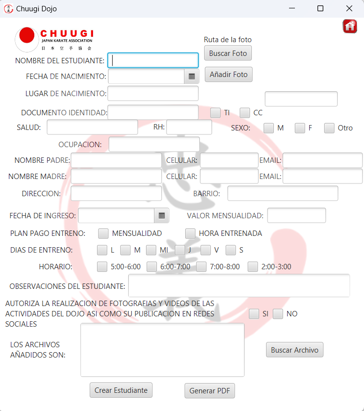

# CHUUGI-DOJO

This is a project created for Chuugi Dojo Karate Academy in the city of Cali-Colombia.

For this project JAVA language is used for the back-end and JAVAFX for the front-end, in the projects we use techniques of UX-UI design so the users could have the best user experience as possible.

It is also user driver-pdf library for the creation of reports and javamail for sending automatic receipts through email.

## Features

- Add new students to the dojo and automatically creating a folder in the local machine for each student documents, when adding any student supporting documents can also be attached to their profile.
- Delete students or edit their information, no previous documents already saved in the local computer would be changed but new ones would be generated.
- Live query to search students in the student list allowing a quick search with the best experience for the user.
- Generate receipts for students payment and option to automatically send it through email as a pdf file.
- Possibility to create a pdf with the current information of the student in the app.
- Dojo information could be changed in the app and the receipts and every document generated from now on will have the updated Dojo information.
- Generate an excel report with the students list and their information at any time.

## Graphical User Interface
### Login Screen

### Menu Screen

### List Screen

### Add Student Screen

### Delete Student Screen

### Create Receipt Screen

### Dojo Information Screen

